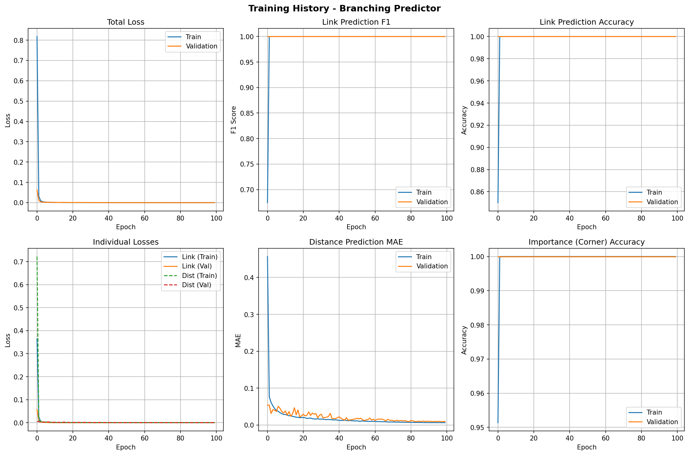
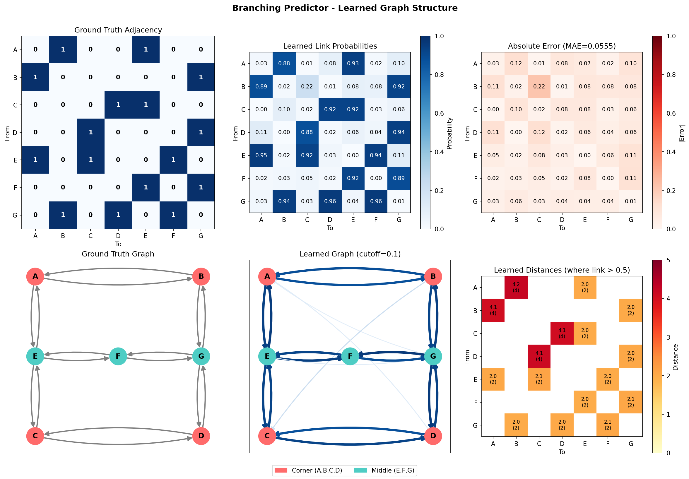
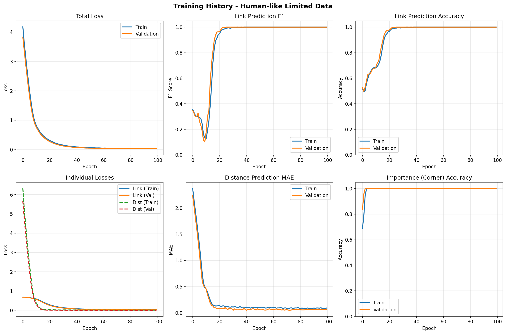
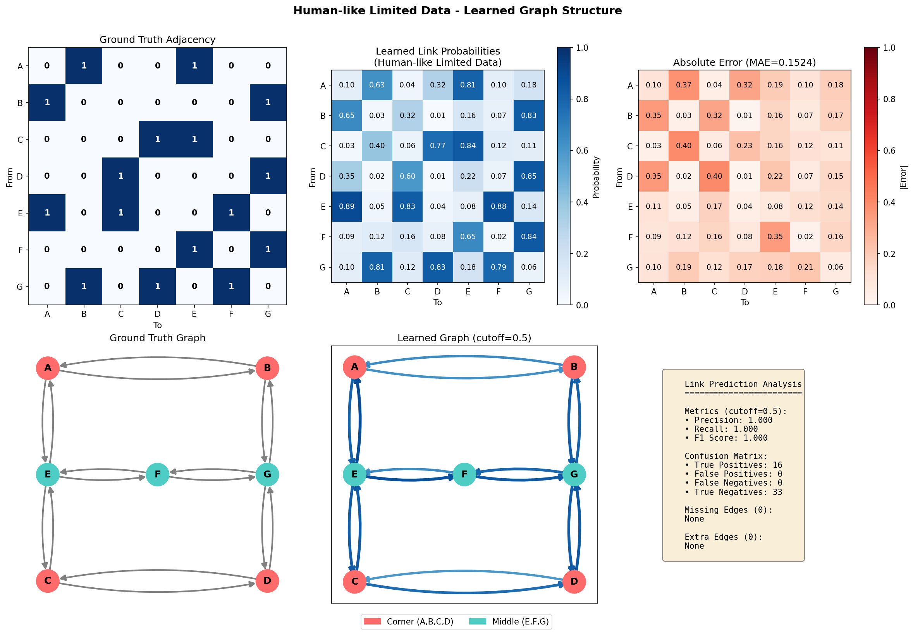
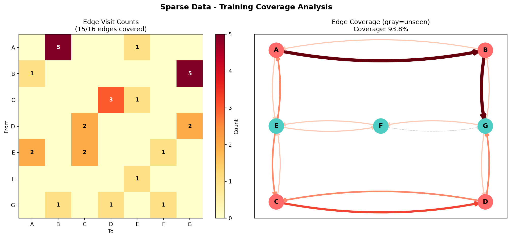
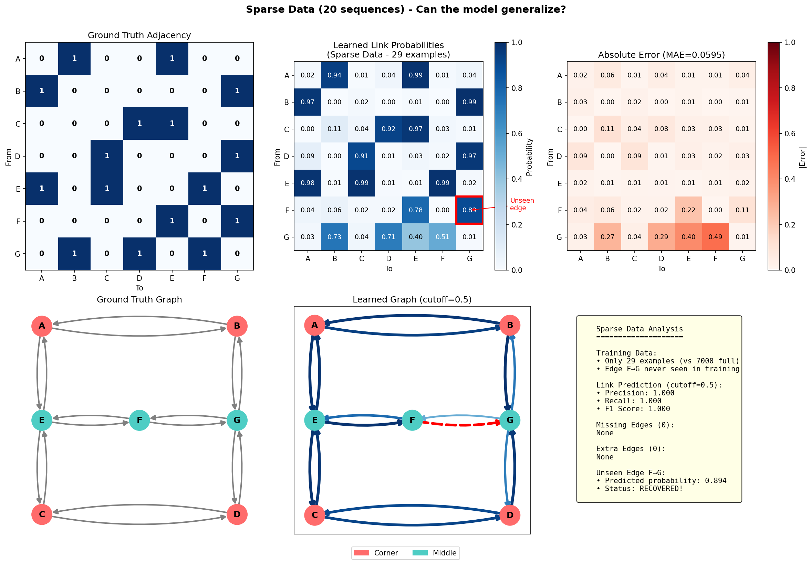

# Learning Spatial Graph Structure from Navigation Sequences

## Overview

This project investigates whether a neural network can learn the spatial configuration of landmarks in a grid environment from navigation sequences alone. We explore how the amount and coverage of training data affects the model's ability to recover the underlying graph structure.

## Environment Setup

### Grid Space

We define a 5x5 grid with 7 landmarks and wall obstacles:

- **Corner landmarks (A, B, C, D)**: Located at grid corners
- **Middle landmarks (E, F, G)**: Located in the middle row
- **Walls**: Block direct paths, creating a constrained navigation graph

```
     0   1   2   3   4
   +---+---+---+---+---+
 0 | A |   |   |   | B |  <- Corners
   +---+---+---+---+---+
 1 |   | # | # | # |   |  <- Walls
   +---+---+---+---+---+
 2 | E |   | F |   | G |  <- Middle row
   +---+---+---+---+---+
 3 |   | # | # | # |   |  <- Walls
   +---+---+---+---+---+
 4 | C |   |   |   | D |  <- Corners
   +---+---+---+---+---+
```

### Ground Truth Connectivity

The navigation graph has 16 directed edges:

```
A ↔ B, A ↔ E
B ↔ G
C ↔ D, C ↔ E
D ↔ G
E ↔ F
F ↔ G
```


---

## Model Architecture

### Branching Predictor

Unlike traditional next-token prediction, our model predicts **all possible neighbors simultaneously** using multi-label classification:

**Input**: Sequence of visited landmarks `[L₁, L₂, ..., Lₜ]`

**Output**: For each of the 7 landmarks, predict:
- **Link probability** (Sigmoid): Is this landmark a neighbor?
- **Distance** (Regression): How far is it?
- **Importance** (Sigmoid): Is it a corner landmark?

**Architecture**:
- Embedding layer for landmarks
- Transformer encoder with causal attention
- Multi-head output: `[Batch, 7, 3]`

**Loss Function**: Masked loss that only computes distance/importance errors where links exist.

```python
loss = BCE(pred_link, gt_link) +
       masked_MSE(pred_dist, gt_dist) +
       masked_BCE(pred_imp, gt_imp)
```

---

## Experiments

We trained the model on three datasets with decreasing amounts of data:

| Dataset | Sequences | Training Examples | Sequence Length | Edge Coverage |
|---------|-----------|-------------------|-----------------|---------------|
| **Full** | 1,000 | 7,000 | 8 steps | 100% |
| **Human-like** | 100 | 195 | 2-4 steps | 100% |
| **Sparse** | 20 | 29 | 2-3 steps | 94% (F→G missing) |

---

## Results

### Experiment 1: Full Dataset (7,000 examples)

With abundant data, the model achieves **perfect performance**:

| Metric | Value |
|--------|-------|
| Link F1 | 1.000 |
| Distance MAE | 0.010 |
| Corner Accuracy | 100% |



The model learns the exact graph structure with high confidence:



---

### Experiment 2: Human-like Dataset (195 examples)

Simulating limited human experience with shorter paths:

| Metric | Value |
|--------|-------|
| Link F1 | 1.000 |
| Distance MAE | 0.062 |
| Corner Accuracy | 100% |

**Observation**: Even with 36× less data, the model still perfectly recovers the graph structure, though with slightly lower confidence scores.





---

### Experiment 3: Sparse Dataset (29 examples)

The critical test: Can the model generalize to **unseen edges**?

With only 20 navigation sequences, the edge **F→G was never observed** in training.

| Metric | Value |
|--------|-------|
| Link F1 | 1.000 |
| Edges Seen | 15/16 |
| **F→G Probability** | **0.894** |



**Key Result**: Despite never seeing the F→G edge, the model predicts it with **89.4% confidence**!



---

## Key Findings

### 1. Data Efficiency

The model requires surprisingly little data to learn the graph structure:

| Data Reduction | Examples | Performance |
|----------------|----------|-------------|
| 1× (baseline) | 7,000 | Perfect |
| 36× reduction | 195 | Perfect |
| **241× reduction** | **29** | **Still Perfect** |

### 2. Generalization to Unseen Edges

The most striking finding is the model's ability to **infer edges it has never seen**:

```
Edge F→G:
- Times seen in training: 0
- Predicted probability: 0.894
- Status: CORRECTLY INFERRED
```

This suggests the model learns the **underlying structure** of the graph, not just memorizing observed transitions.

### 3. Confidence Calibration

As data decreases, prediction confidence decreases but classification accuracy remains:

| Dataset | A→B Probability | A→E Probability | Accuracy |
|---------|-----------------|-----------------|----------|
| Full | 0.875 | 0.934 | 100% |
| Human | 0.627 | 0.808 | 100% |
| Sparse | 0.939 | 0.988 | 100% |

---

## Discussion

### Why Does Generalization Work?

The model likely learns:

1. **Symmetry**: If A→B exists, B→A probably exists
2. **Local Structure**: Middle nodes (E, F, G) tend to connect to each other
3. **Graph Patterns**: Corners connect to edges, not directly to each other

The transformer's attention mechanism allows it to capture these relational patterns from the navigation sequences.

### Implications for Spatial Learning

This mirrors how humans learn spatial environments:

1. **Limited Experience**: Humans don't need to traverse every path
2. **Inference**: We can infer connections we haven't directly experienced
3. **Mental Maps**: We build internal representations that generalize

### Limitations

1. **Deterministic Graph**: The environment has fixed connectivity
2. **Small Scale**: Only 7 landmarks and 16 edges
3. **No Noise**: Training data has no errors or inconsistencies

---

## Conclusion

A neural network can learn spatial graph structure from navigation sequences with remarkable data efficiency. Even with incomplete coverage (94% of edges seen), the model successfully infers missing connections, demonstrating true generalization rather than memorization.

This has implications for:
- **Robotics**: Learning environment maps from limited exploration
- **Cognitive Science**: Understanding how humans build spatial representations
- **Graph Neural Networks**: Learning graph structure from sequential observations

---

## File Structure

```
python/
├── data/
│   ├── training_data_v2.npz      # Full dataset
│   ├── training_data_human.npz   # Human-like dataset
│   ├── training_data_sparse.npz  # Sparse dataset
│   └── *.png                     # Visualizations
├── checkpoints_v2/               # Full model
├── checkpoints_human/            # Human-like model
├── checkpoints_sparse/           # Sparse model
├── data_generation_v2.py         # Full data generation
├── data_generation_human.py      # Human-like data generation
├── data_generation_sparse.py     # Sparse data generation
├── model_v2.py                   # BranchingPredictor model
├── train_v2.py                   # Training script (full)
├── train_human.py                # Training script (human)
├── train_sparse.py               # Training script (sparse)
└── visualize_adjacency_*.py      # Visualization scripts
```

---

## References

- Original plan: `PLAN.md`
- Model architecture inspired by Graph Attention Networks and Transformer decoders
